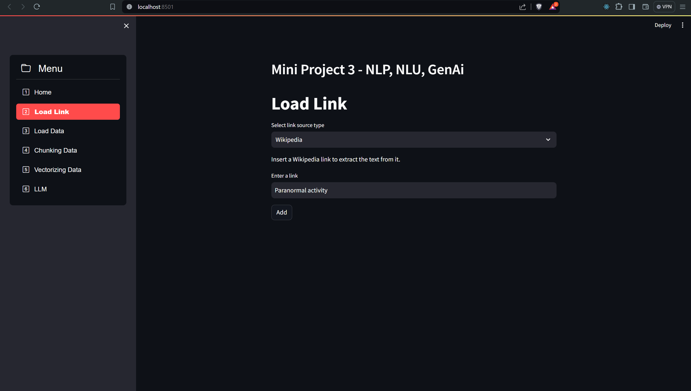
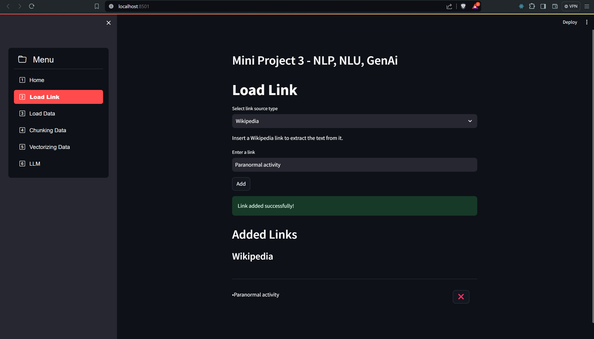
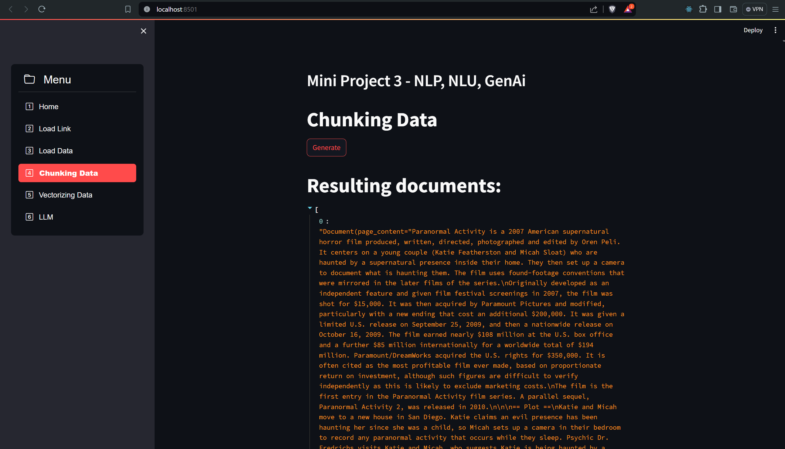
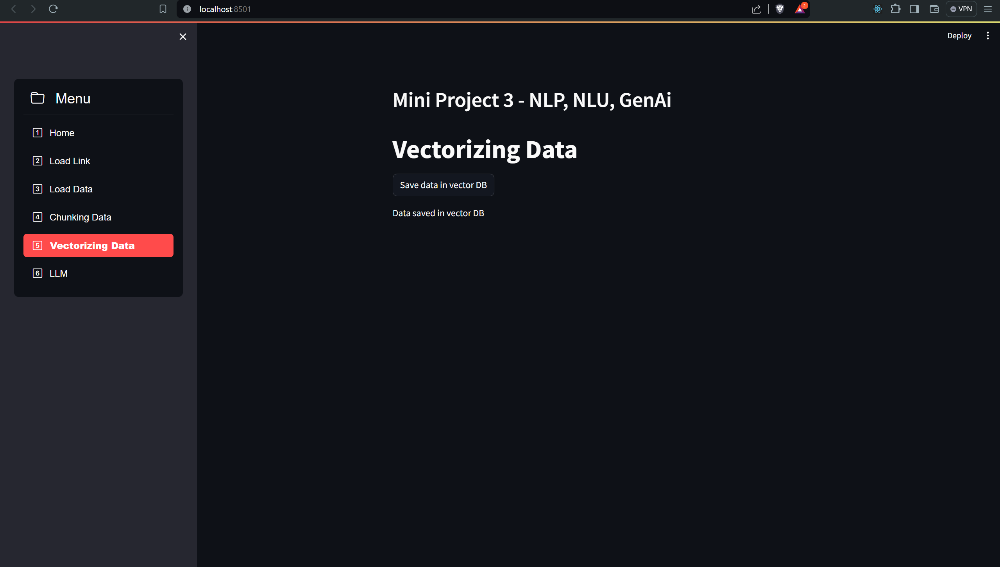
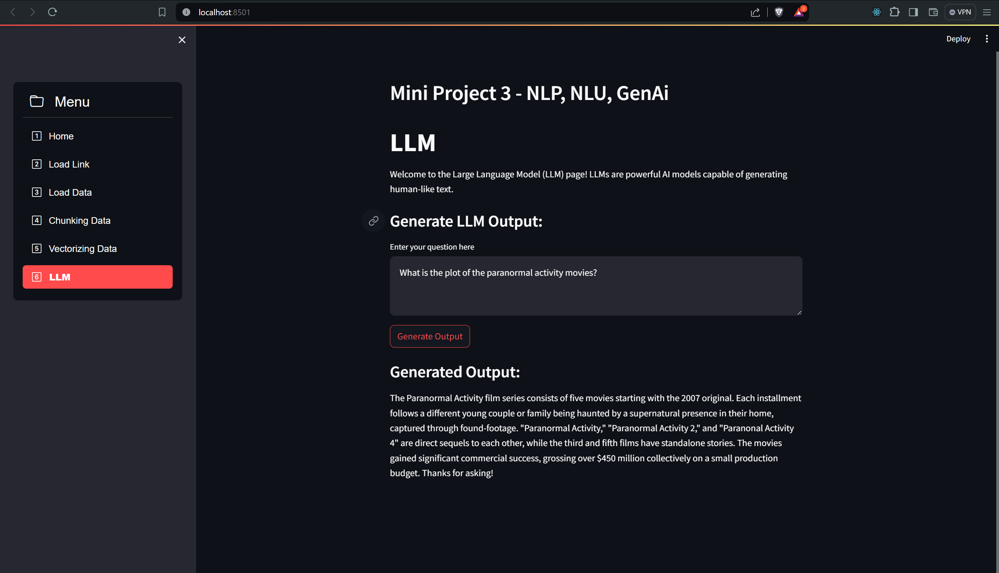

# Miniproject 3 (GenAI)
**By Pejomi (Peter, Jonas & Mie)**

## Description

This project demonstrates how to work with NLP (Natural Language Processing) NLU (Natural Language Understanding).

The project is a Streamlit application that can take different types of input data and extract the most important information from the input data in which the user can start asking questions about the data.

## Requirements

* `pip install streamlit`
* `pip install streamlit_option_menu`
* `pip install spacy`
* `pip install langdetect`
* `pip install wordcloud`
* `pip install langchain`
* `pip install wikipedia`
* `pip install sentence-transformers`


## Input Data
The types of input data that the application can handle are:

- Wikipedia page
- PDF file

## Getting Started

To get started with the project, you need to clone the repository and install the required packages.

Open a terminal and run the following commands to start the application:
```bash
streamlit run app.py
```
Then a browser window will open with the application running.

Start loading the input data and ask questions about the data by following the pages in the application menu.

## Business implementation
This sort of application can be implemented for many different things. For example can you implement a chatbot for movie recommendations and explanations. In our example, we gave the LLM context about the "Paranormal Activity" movies.

## Screenshot

### Step 1:


### Step 2:


### Step 3:


### Step 4:


### Step 5:
